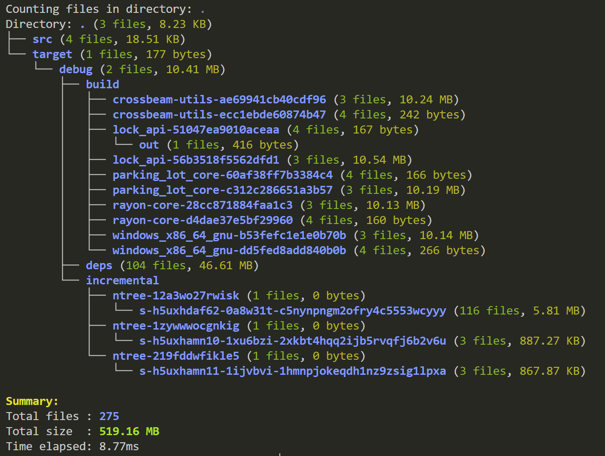

# ntree

Count the files in directories

## Features



```bash
Usage: ntree.exe [OPTIONS] [DIRECTORY]

Arguments:
  [DIRECTORY]  Target directory, defaults to current directory [default: .]

Options:
      --ext <EXT>          Filter by file extension
      --ignore <DIR>       Ignore directories with specified names
      --min <SIZE>         Filter files smaller than specified size
      --max <SIZE>         Filter files larger than specified size
  -c, --children           Include child directory files in current directory statistics
  -n, --num                Show only directory statistics, not the file tree
  -L, --level <MAX_DEPTH>  Limit search depth, 0 means unlimited [default: 0]
  -h, --help               Print help
  -V, --version            Print version
```

## Installation

```bash
cargo install --git https://github.com/kongdd/tree-cli.rs
```

### Usage

```bash
ntree /path/to/directory
ntree /path/to/directory --ext exe # With Extension Filter
ntree /path/to/directory --min 1MB # Only files larger than 1MB
ntree /path/to/directory --max 100MB # Only files smaller than 100MB
ntree /path/to/directory -L 2 # Limit directory depth to 2 levels
```

## References

- <https://github.com/peteretelej/tree>
